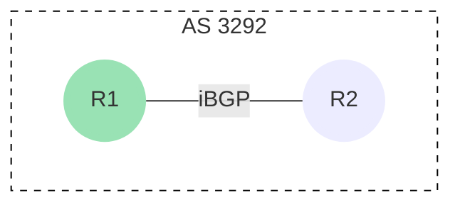
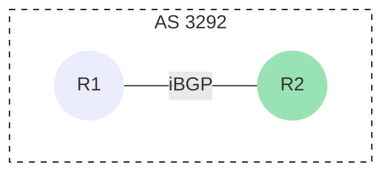
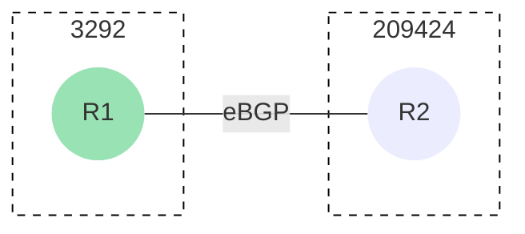
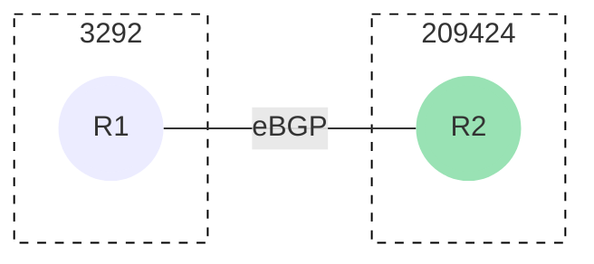

# BGP (Border Gateway Protocol) 
BGP er en routingprotokol, der bruges til at styre routing og udveksling af ruteinformation på internettet og i store private netværk.

<center>

> eBGP [klik her](/Routing%20Protocols/EGP/BGP/EBGP.md) &nbsp;&middot;&nbsp;
> iBGP [klik her](/Routing%20Protocols/EGP/BGP/IBGP.md) &nbsp;
> 
</center>

## Vigtigste funktioner:

- **Routingprotokol:** BGP er en path-vector-protokol, der bestemmer de bedste ruter til dataoverførsel.

- **Autonome systemer (AS):** Internettet er opdelt i autonome systemer, og BGP bruges til at udveksle ruteinformation mellem disse.

- **Politikbaseret routing:** BGP tillader netværksadministratorer at implementere politikker for at styre rutevalg.

- **Stabilitet og pålidelighed:** BGP er designet til at være meget stabil og pålidelig.

- **Peer-til-peer-forbindelser:** BGP bruger TCP-baserede peer-til-peer-forbindelser mellem routere.

- **Internetudbydere og store organisationer:** BGP er afgørende for internetudbydere og store organisationer til styring af deres netværk og ruteopdateringer.

BGP spiller en central rolle i at sikre effektiv og pålidelig dataoverførsel på internettet.


### Autonome systemer (AS):

Hele BGP er bygget op på de her Autonome systemer (autonomous systems).
Man kan se et AS, som en selvstændig sky, eller udbyder. 


**eBGP:** Dette er en del af BGP, hvor internetudbydere udveksler routingtabeller med hinanden. Dette gør det muligt for dem at sende trafik på tværs af deres AS'er og til andre AS'er på internettet. eBGP spiller en afgørende rolle i at sikre, at internettrafikken når sin destination effektivt.

**iBGP:** Det er stort set det samme som eBGP, men iBGP bliver brugt internt i skyen. (i samme AS)<br>

### iBGP:

Lig mærke til at alle har det samme AS nummer, og at remote-as er det samme som routers AS.
+++ :icon-x-circle: R1
```js
router bgp 3292
neighbor 10.10.10.1 remote-as 3292
```


+++ :icon-x-circle: R2
  ```js
router bgp 3292
neighbor 10.10.10.2 remote-as 3292
```


+++


### eBGP:

Her kan du se at de har forskellige AS numre, og at remote-as er den anden routers AS. 


+++ :icon-x-circle: R1
```
router bgp 3292
neighbor 10.10.10.1 remote-as 209424
```

+++ :icon-x-circle: R2

  ```
router bgp 209424
neighbor 20.20.20.1 remote-as 3292
```



+++
 ## Sikkerhed 
BGP (Border Gateway Protocol) er ikke designet til at tillade automatisk tilføjelse af routere, primært af hensyn til internettets sikkerhed og stabilitet.

1. **Kontrolleret tilføjelse:** BGP er primært brugt af internetudbydere (ISPer) og store organisationer til at styre internetrouting. De har omhyggeligt planlagte procedurer for tilføjelse af nye routere og annoncering af nye netværkspræfikser. Denne kontrol er afgørende for at undgå uautoriseret og potentielt skadelig trafikdirigering.

2. **Politikbaseret routing:** BGP gør det muligt for netværksadministratorer at implementere politikker for at styre, hvordan trafik dirigeres gennem deres netværk. 

3. **Beskyttelse mod fejl og angreb:** Internetrouting er sårbar over for fejl og målrettede angreb. Ved at kræve manuel konfiguration og validering af nye routere og annoncerede ruter kan netværksadministratorer minimere risikoen for utilsigtede fejl og ondsindede handlinger.

4. **Stabilitet og konvergens:** BGP er designet til at opretholde internettets stabilitet, og det tager hensyn til konvergenshastighed og beslutningsprocesser. Automatisk tilføjelse af routere kunne føre til hurtige og potentielt skadelige ændringer i routingtabeller, der kan påvirke internettets drift og føre til ustabilitet.

I det store billede giver BGP's manuelle konfiguration og kontrollerede proces netværksadministratorer mulighed for at opretholde kontrol over deres egne netværk og beskytte internettets integritet og pålidelighed. 
 
