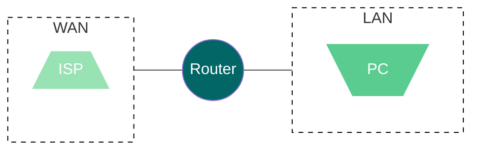

Et netværk er det der forbinder Compuetere  og andre netværks enheder sammen, så de kan kommuniker.

Der er 2 typer af netværk, LAN og WAN.

## LAN

Et LAN (Local Area Network) er et netværk som er begrænset til et lille område, som f.eks. et hus eller en bygning.
Et  LAN er typisk et privat netværk, som kun er tilgængeligt for de enheder som er tilsluttet netværket.
Man kan også have et LAN som er tilgængeligt for alle, som f.eks. et offentligt wifi netværk.

[!badge text="LAN" variant="light" ](/test.md)

## WAN
WAN (Wide Area Network) er et netværk som er større end et LAN, og er typisk et netværk som er tilgængeligt for alle.
Et eksempel på et WAN er internettet, som er et netværk som er tilgængeligt for alle.

