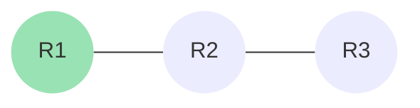
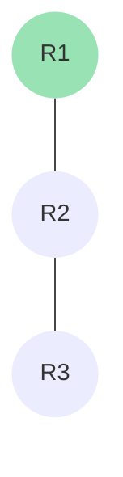
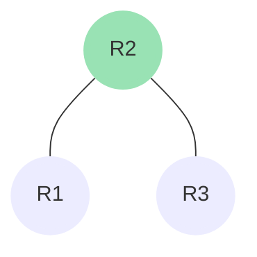
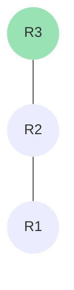

# OSPF

OSPF er en [!badge text="IGP" variant="ghost" ](/test.md) (Interior Gateway Protocol), som bruges til dynamisk routing.<br>

OSPF står for Open Shortest Path First, og er en af de mest brugte routing protokoller.<br>
Navnet er lidt misledende da det ikke er den fysiske korteste vej den vælger.<br>
Den vælger den vej der har den laveste [!badge text="metric" variant="ghost" ] (omkostning).
Metric er en værdi der bliver beregnet sp ledes: [!badge text="båndbredde / interface hastighed" variant="ghost" ].<br>


OSPF er en link-state protokol, hvilket betyder at den sender information omkring alle sine naboer til alle andre routere i netværket.

Routerne ser sig selv som toppen af netværket, og alle andre routere er naboer til dem.
Her er et viruelt eksempel på det:
+++ :icon-workflow: Topologi

+++ :icon-x-circle: R1


+++ :icon-x-circle: R2

+++ :icon-x-circle: R3

+++

## LAB Setup

 

### Plan

Vi skal konfigurere OSPF på alle routere, så de kan snakke sammen.
I dette setup bruger vi et single area, hvilket betyder at alle routere er i samme område. (area 0)

### Konfiguration

+++ :icon-x-circle: R1
```js
router ospf 1
 network
```
 
+++ :icon-x-circle: R2
```js
router ospf 1
 network
```

+++ :icon-x-circle: R3
```js
router ospf 1
 network
```

+++


