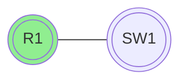
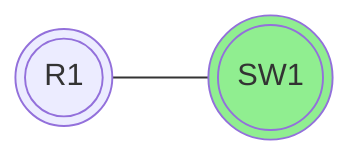

I denne guide vil jeg tage dig igennem din første konfiguration af en cisco router og switch. (ios)

Her er en simpel konfiguration af en [!badge text="router" variant="ghost" ](router.md) og en [!badge text="switch" variant="ghost" ](router.md).

+++ :icon-x-circle: R1
```js
interface fastethernet 0/0
 ip address 172.16.0.1 255.255.255.0
 no shutdown

```

+++ :icon-arrow-switch: SW1 
```js
interface vlan 1
 ip address 172.16.0.2 255.255.255.0
 no shutdown

```

+++

## LAN 

Det vi lige har konfigureret er et [!badge text="LAN" variant="ghost" ](/test.md) (Local Area Network), som er et netværk som er begrænset til et lille område, som f.eks. et hus eller en bygning.

konfiguration af et LAN er meget simpelt, da det bare er at sætte en ip-adresse på interfacet man ønsker at bruge.


```js 