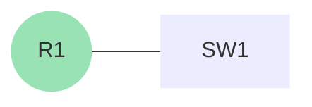
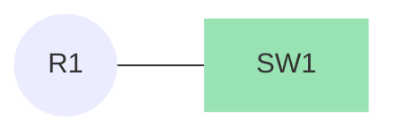

## Første konfiguration

I denne guide vil jeg tage dig igennem din første konfiguration af en cisco router og switch. (ios)

Her er en simpel konfiguration af en [!badge text="router" variant="ghost" ](router.md) og en [!badge text="switch" variant="ghost" ](router.md).
### Opstart af router og user EXEC Mode

Når du starter din router op for første gang, vil du blive mødt af en prompt, som ser sådan her ud:

```js
would you like to enter the initial configuration dialog? [yes/no]: 
```
Her er det vigtigt at vi vælger nej, da vi selv vil konfigurere routeren.<br>
Så du skriver bare `no` og trykker enter.

nu vil den prompte Promte dig med en anden prompt, som ser sådan her ud:

```js
Press RETURN to get started!
```

Så du trykker selvfølgelig bare enter, og så vil du blive mødt af en prompt, som ser sådan her ud:

```js
Router>
```
Når du kan se et > tegn, efterfulgt af routerens navn, er du i det der hedder [!badge text="user EXEC Mode" variant="ghost"], som er en begrænset tilstand, hvor du ikke kan lave de store ændringer.

### Privileged EXEC Mode

Så derfor skriver vi `Enable` og trykker enter, så vi kan komme ind i [!badge text="Privileged EXEC Mode" variant="ghost" ](#privileged-exec-mode), som er en tilstand hvor vi kan se hele routerens konfiguration, og lave små ændringer.

Når du er i [!badge text="Privileged EXEC Mode" variant="ghost" ](#privileged-exec-mode) så ser prompten sådan her ud:

```js
Router#
```
Det er typisk her vi ville lave `ping`, og `show` kommandoer.

### Global Configuration Mode
Vi vil meget gerne et tand højere op, så vi skriver `configure terminal` og trykker enter, så vi kan komme ind i [!badge text="Global Configuration Mode" variant="ghost" ](#global-configuration-mode), som er en tilstand hvor vi kan lave ændringer i routerens konfiguration.

Når du er i [!badge text="Global Configuration Mode" variant="ghost" ](#global-configuration-mode) så ser prompten sådan her ud:

```js
Router(config)#
```
Det er denne mode hvor vi laver alle vores ændringer, og det er også her vi vil lave vores første konfiguration.<br>

### Hostname

Det første vi starter med, er at give routeren et navn, så vi kan identificere den.<br>
for at gøre dette skiver vi følgende:

```js
hostname R1
```
hostname er en kommando som sætter routerens navn, og R1 er det navn vi har valgt at give routeren.<br>
`hostname <navn>` 
!!!warning Info
Bemærk at der ikke må være mellemrum i navnet.<br>
`hostname R 1` :icon-x-circle-fill:<br>
`hostname R1` :icon-feed-issue-closed:<br>

!!!
Når du har skrevet kommandoen, trykker du enter, og prompten vil nu se sådan her ud:
```js
R1(config)#
```

### Interface mode / IP-adresse

Nu har vi givet routeren et navn, så nu vil vi gerne sætte en `ip-adresse` på routeren, så vi kan sætte den til at kommunikere med andre enheder.

For at gøre dette, skal vi ind i interface mode, som er en tilstand hvor vi kan lave ændringer på de forskellige porte på routeren.

For at komme ind i interface mode, skriver vi `interface <navn på interface>` og trykker enter.<br>
På nogen routere kan der være forskellige interfaces, som fx FastEthernet og GigabitEthernet.
Denne router har kun FastEthernet interfaces, så vi skriver `interface fastethernet 0/0` og trykker enter.
`fastethernet` er hastigheden på porten, og `0/0` er port nummeret.

Hvis du er i tvivl om hvilke interfaces der er på din router, kan du skrive `show ip interface brief` og trykke enter, så vil du få en liste over alle interfaces på routeren.
!!!warning Info om kommandoer i forskellige modes.
Bemærk at alle `show` kommandoer skal skrives i [!badge text="Privileged EXEC Mode" variant="ghost" ](#privileged-exec-mode), og ikke i [!badge text="Global Configuration Mode" variant="ghost" ](#global-configuration-mode).<br>
Du kan skrive `do` foran kommandoen, så vil den virke i [!badge text="Global Configuration Mode" variant="ghost" ](#global-configuration-mode).<br>
Hvis du ikke lige magter at skrive hele kommandoen, kan du også bare skrive `sh ip int br` og trykke enter, så vil den også virke.<br>

Der er rigtig mange forkortelser i ios, så det er bare med at lære dem, så du kan skrive dem hurtigt. :smile: <br>
evt se listen her: [Cisco IOS Shortcuts](#interface-mode--ip-adresse) 


!!!

Når du er i interface mode, så ser prompten sådan her ud:
```js	
R1(config-if)#
```
Nu er vi i interface mode, og vi vil gerne sætte en ip-adresse på porten, så vi kan sætte den til at kommunikere med andre enheder.

kommandoen til dette er `ip address <ip-adresse> <subnetmaske>`
Vi vil gerne sætte ip-adressen `172.16.0.1` på porten, så vi skriver `ip address 172.16.0.1 255.255.255.0` og trykker enter.

Når du har skrevet kommandoen, trykker du enter, og prompten vil nu se sådan her ud:
```js
R1(config-if)#
```
Grunden til jeg bliver ved med at skrive prompten, er for at du kan se og forstå hvilken mode du er i. :smile: <br>
Dette er meget vigtigt, at forstå, da nogen kommandoer kun kan bruges i bestemte modes.<br>

Nu har vi sat en ip-adresse på porten, så nu vil vi gerne aktivere porten, så den kan sende og modtage data.

For at gøre dette, skriver vi `no shutdown` og trykker enter.

Når du har skrevet kommandoen, trykker du enter, og nu vil der komme en masse tekst på skærmen, som ser sådan her ud:
```js
R1(config-if)# %LINK-5-CHANGED: Interface FastEthernet0/0, changed state to up
```
Dette er bare routeren som fortæller os at porten er blevet aktiveret / slået til.<br>
Hvis du nu skriver `end` og trykker enter, vil du komme tilbage til [!badge text="Privileged EXEC Mode" variant="ghost" ](privilegemode.md).<br>
`exit` tager dig ud af den mode du er i, og tilbage til den mode du var i før.<br>
`end` tager dig ud af den mode du er i, og tilbage til [!badge text="Privileged EXEC Mode" variant="ghost" ](privilegemode.md).
```js
R1#
```
Dette betyder at du er tilbage i [!badge text="Privileged EXEC Mode" variant="ghost" ](privilegemode.md), og du kan nu se din konfiguration ved at skrive `show running-config` og trykke enter.

Du vil nu i bunden af terminalen se et promt som ser sådan her ud:
```js
--More--
```
Dette betyder at der er mere tekst, som ikke kan vises på skærmen, så du skal trykke på `mellemrum` for at kunne se hele konfigurationen. <br>
Eller `enter` for at se en linje ad gangen.
Konfigurationen vil se sådan her ud:
```js
Current configuration : 571 bytes
!
version 12.4
no service timestamps log datetime msec
no service timestamps debug datetime msec
no service password-encryption
!
hostname R1
!
!
!
!
!
!
!
!
ip cef
no ipv6 cef
!
!
!
!
!
!
!
!
!
!
!
!
spanning-tree mode pvst
!
!
!
!
!
!
interface FastEthernet0/0
 ip address 172.16.0.1 255.255.255.0
 duplex auto
 speed auto
!
interface FastEthernet0/1
 no ip address
 duplex auto
 speed auto
 shutdown
!
interface Vlan1
 no ip address
 shutdown
!
ip classless
!
ip flow-export version 9
!
!
!
!
!
!
!
!
line con 0
!
line aux 0
!
line vty 0 4
 login
!
!
!
end
```

Alle de `!` er bare kommentarer, som ikke har nogen betydning for konfigurationen.<br>
De adskillere blot de forskellige sektioner af konfigurationen.
!!!warning Info
Bemærk at der ikke står `no shutdown` nogen steder i running-config.<br>
Dette er fordi ios kun viser `shutdown`, så hvis du ikke kan se `shutdown` på en port, så er den aktiv.

!!!

Her er alt den samlede konfiguration vi har lavet på routeren:


```js
hostname R1
!
interface fastethernet 0/0
 ip address 172.16.0.1 255.255.255.0
 no shutdown
```


#  dette er en test


+++ :icon-x-circle: R1
```js
hostname R1

interface fastethernet 0/0
 ip address 172.16.0.1 255.255.255.0
 no shutdown

```


+++ :icon-arrow-switch: SW1 
```js
hostname SW1

interface vlan 1
 ip address 172.16.0.2 255.255.255.0
 no shutdown
```


+++
## LAN 

Det vi lige har konfigureret er et [!badge text="LAN" variant="ghost" ](/test.md) (Local Area Network), som er et netværk som er begrænset til et lille område, som f.eks. et hus eller en bygning.

konfiguration af et LAN er meget simpelt, da det bare er at sætte en ip-adresse på interfacet man ønsker at bruge.


```js 