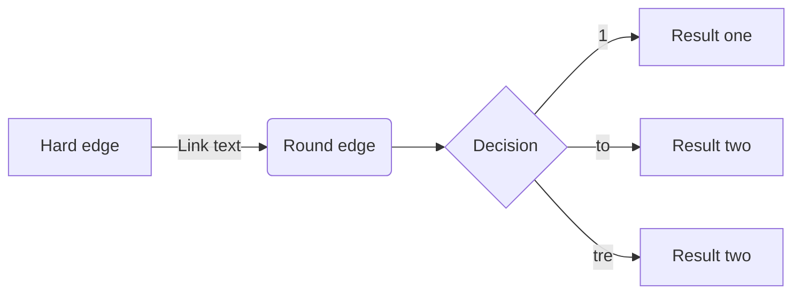
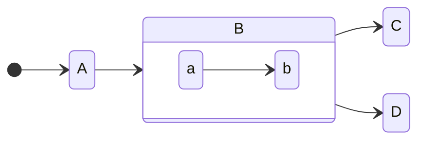

# Velkommen til **NETDEV**.

## Hvad er NETDEV?

Vi er en dokumentations hjemmeside som er lavet for at få nem og hurtig adgang til informationer omkring netværk og netværksudstyr.

Samt er målet også at folk der intet ved, kan lære noget omkring netværk og netværksudstyr.

```html
<h1>Velkommen til NETDEV.</h1>
<p>Vi er en dokumentations hjemmeside som er lavet for at få nem og hurtig adgang til informationer omkring netværk og netværksudstyr.</p>
<p>Samt er målet også at folk der intet ved, kan lære noget omkring netværk og netværksudstyr.</p>
```
> This is the first level of quoting.
>
> > This is nested blockquote.
>>
> > > Back to the first level.

*   Lorem ipsum dolor sit amet, consectetuer adipiscing elit.
    Aliquam hendrerit mi posuere lectus. Vestibulum enim wisi,
    viverra nec, fringilla in, laoreet vitae, risus.
*   Donec sit amet nisl. Aliquam semper ipsum sit amet velit.
    Suspendisse id sem consectetuer libero luctus adipiscing.

    *   Lorem ipsum dolor sit amet, consectetuer adipiscing elit.
Aliquam hendrerit mi posuere lectus. Vestibulum enim wisi,
viverra nec, fringilla in, laoreet vitae, risus.
*   Donec sit amet nisl. Aliquam semper ipsum sit amet velit.
Suspendisse id sem consectetuer libero luctus adipiscing.


<a href="&#x6D;&#x61;i&#x6C;&#x74;&#x6F;:&#x61;&#x64;&#x64;&#x72;&#x65;
&#115;&#115;&#64;&#101;&#120;&#x61;&#109;&#x70;&#x6C;e&#x2E;&#99;&#111;
&#109;">&#x61;&#x64;&#x64;&#x72;&#x65;&#115;&#115;&#64;&#101;&#120;&#x61;
&#109;&#x70;&#x6C;e&#x2E;&#99;&#111;&#109;</a>

| Syntax      | Description | Test Text     |
| :---        |    :----:   |          ---: |
| Header      | Title       | Here's this   |
| Paragraph   | Text        | And more      |

[!badge Badge](badge.md)



[!button icon="rocket" text="github"]

+++ Apple
This is an apple 🍎
+++ Orange
This is an orange 🍊
+++ Banana
This is a banana 🍌