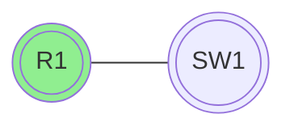
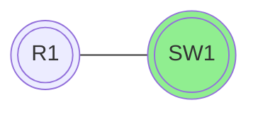

# Velkommen til **NETDEV**.


## Dansk Dokumentation

Vi er en dokumentations hjemmeside som er lavet for at få nem og hurtig adgang til informationer omkring netværk og netværksudstyr.

Samt er målet også at folk der intet ved, kan lære noget omkring netværk og netværksudstyr.

Guides og dokumentation er skrevet på dansk, da det er det sprog vi bedst kan.

Nedenfor kan du se de forskellige kategorier vi har lavet guides til.

### Eksemple på en guide

Her er en simpel konfiguration af en [!badge text="router" variant="ghost" ](router.md) og en [!badge text="switch" variant="ghost" ](router.md).

+++ :icon-x-circle: R1
```js
interface fastethernet 0/0
 ip address 172.16.0.1 255.255.255.0
 no shutdown

```

[!button text="Gå til guide"](/Starterguide/starter-guide)
+++ :icon-arrow-switch: SW1 
```js
interface vlan 1
 ip address 172.16.0.2 255.255.255.0
 no shutdown

```

[!button text="Gå til guide"](/Starterguide/starter-guide)
+++


