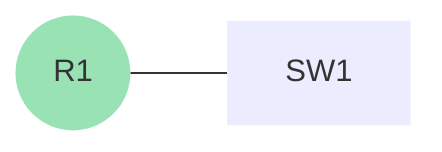
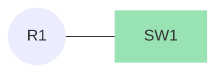

#  dette er en Test


+++ :icon-x-circle: R1
```js
hostname R1

interface fastethernet 0/0
 ip address 172.16.0.1 255.255.255.0
 no shutdown

```


+++ :icon-arrow-switch: SW1 
```js
hostname SW1

interface vlan 1
 ip address 172.16.0.2 255.255.255.0
 no shutdown
```


+++
## LAN 

Det vi lige har konfigureret er et [!badge text="LAN" variant="ghost" ](/test.md) (Local Area Network), som er et netværk som er begrænset til et lille område, som f.eks. et hus eller en bygning.

konfiguration af et LAN er meget simpelt, da det bare er at sætte en ip-adresse på interfacet man ønsker at bruge.


[!ref target="news2" text="Retype"](https://retype.com/)
[!button variant="success" text="Primary"]
[!badge variant="warning" text="Info"]

||| Title with emoji :thumbsup:

A column title with the [emoji](emoji.md) `:thumbsup:`.

||| Title with icon :icon-check-circle:

A column title with the [icon](icon.md) `:icon-check-circle:`.

|||
